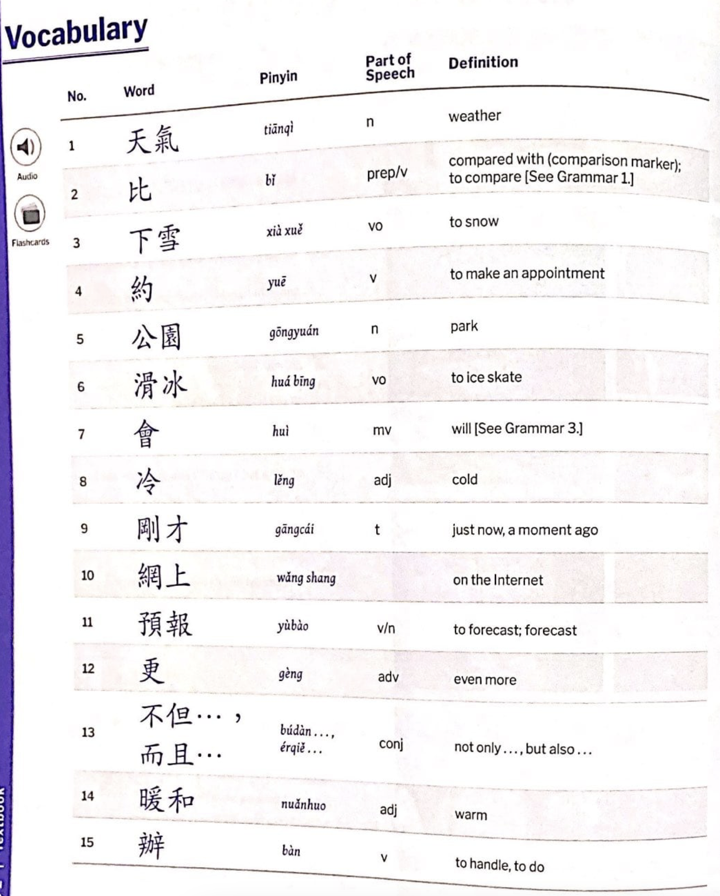

# Created by Isaac Saxonov,  Dec 13th 2024

## Description:
This program takes a set of images of Chinese vocabulary tables from textbooks, and converts them into a format that can be uploaded to Quizlet to create a set of flashcards.

Example image of vocabulary table:

# Download
> I've opted to use pyinstaller to turn the script into an executable. This makes it easier for less python-savvy people to use at the cost of a relatively long start-up time.

# Usage
1. Check off whether you are using traditional or simplified characters
2. Input the chosen image(s)
3. Enable heteronym selection for most accurate results (More on this below)
4. Click process images
5. Assign where each attribute should go (pinyin on one side, word and definition on the other, part of speech disabled, etc)
6. Click export and simply copy the relevant text

### Follow these directions to import the flashcards into Quizlet:
1. Go to quizlet.com
2. Click on the plus icon at the top toward the right
3. Click flashcard set
4. Click create by yourself
5. Click +import
6. Paste the text
7. Make sure the "Between term and definition" option is *tab* and the "Between cards" option is *Semicolon*
8. Click import 

# Design

### Utilizes PaddleOCR in tandem with EasyOCR for Chinese and English character recognition
PaddleOCR first scans the entire given image. Then for all of the locations classified as Chinese characters, EasyOCR reads them as well. For these Chinese characters, if PaddleOCR's result is shorter in length than EasyOCR's or has a confidence level less than 90%, EasyOCR's result is used in its place.

### First phase of bounding box merging
Bounding boxes that are very close to each other or overlapping are merged if they don't contain Chinese characters. This is because long English text is often split into multiple lines which should be classifed as the same blurb of text, while different Chinese character bounding boxes in vocabulary textbooks are generally separate phrases. Chinese characters are also a lot less condensed than English ones, meaning they will generally be more prone to merging with each other if the criteria for merging is strictly proximity based.

### Boxes are then grouped into rows
Items with similar y-values are placed in the same row. Each row is sorted by x-value, and the set of rows are sorted by y-value.

### Second phase bounding box merging
Bounding boxes that are close together (with a less strict threshold than the first merging phase), where one is in a row by itself, are analyzed. If by merging these two boxes, both become closer to a row (that consists of elements different than those two), then the merge is performed regardless of character type. This is because there are sometimes multiline Chinese phrases that will be classified as separate ones. If two close elements have a row of other elements right between them, it is likely they are actually the same element.

### Clean rows
The mode number of elements in the rows is calculated. Rows that aren't within 1 element of the mode number of items are discarded. This is to account for minor OCR errors and when an attribute of a Chinese phrase is not applicable. If a row has one less item than the mode, where the missing item should have been will be found based on the position of elements in other rows. This missing item will be filled in with "Not found". If a row has one more item than the mode, the extra item will be found based on the position of elements in other rows, and will be removed.

### Get header rows
Once cleaned, the top row should hold the different categories/attributes of the phrases (definition, pinyin, part of speech, etc). This is used in the GUI to allow the user to select which side of the flash card each attribute should be on.

### Converted to Quizlet format
The data is then converted to Quizlet format so that it can be imported as a set of flashcards.

# Limitations
### Image Orientation
Though it doesn't have to be perfect, the closer the image is to completely straight, the better the program will run.
### Pinyin
Because neither of the models are able to detect the tone markings on pinyin, I've opted to use the pypinyin python library to translate the Chinese characters into pinyin instead. The program looks at the "word" category and then translates that word into pinyin, replacing the corresponding item in the "pinyin" category. This requires the "word" and "pinyin" categories to actually exist. In addition, because Chinese characters can have different pronounciations based on their context, single character phrases/words that don't have the added context of a complimentary character can be misinterpereted. Though pypinyin is usually accurate, there is an "Enable Heteronym Selection" flag that when checked, prompts the user to input the correct heteronym, if mulitple are found in a single Chinese character element.